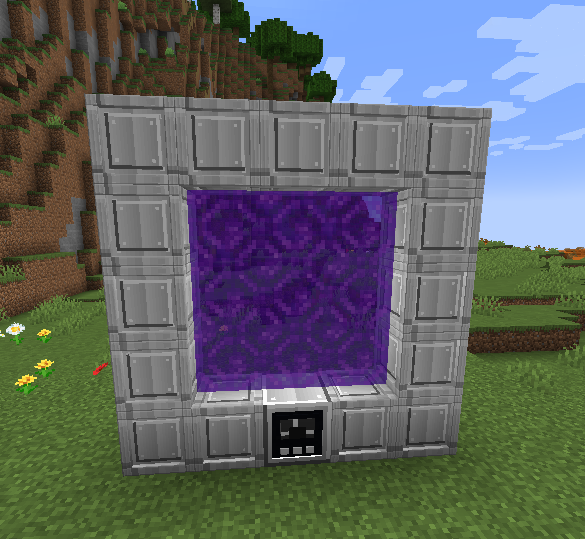
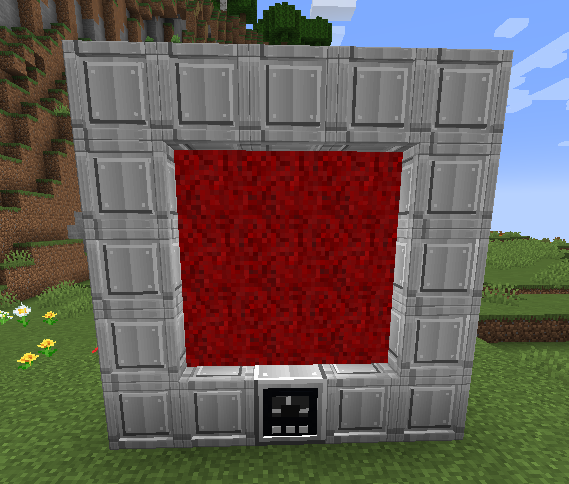

# Gateway

[Português](../pt/gateway.md)

The Gateway is your route into Realities. Overworld Rifts introduce dimensional creatures early; a powered Gateway lets you deliberately choose and revisit destinations.

## Assemble the frame

Build a **vertical 5×5 outline** with a **3×3 empty interior**. Place the **Gateway Terminal** in the bottom center: the structure needs **15 Gateway Frame Blocks and one Terminal**.

```text
F F F F F
F . . . F
F . . . F
F . . . F
F F T F F
```



The Terminal's facing determines the portal plane. Keep the interior clear and supply FE to the Terminal. Both Terminal and Frame recipes use the Void Station's large grid; see [exact layouts](recipes.md).

## Scan, save and open

An assembled, powered outbound Terminal scans automatically every **200 eligible ticks** (normally ten seconds), with a **95% success chance** per attempt. Each attempt costs **1 million FE**, including unsuccessful attempts. Return Terminals do not scan. The Terminal supports up to **ten saved Realities**. Review a destination's tier, terrain type and resource quality before opening it.

The Terminal has a **512 million FE buffer** and accepts up to **16 million FE per transfer**. Opening and upkeep scale with destination tier:

| Destination | Opening FE | Upkeep FE/t |
|---|---:|---:|
| Unstable | 1,000,000 | 1,000 |
| Stable | 2,000,000 | 2,000 |
| Void | 4,000,000 | 4,000 |
| Stellar | 8,000,000 | 8,000 |
| Duality | 16,000,000 | 16,000 |
| Darklight | 32,000,000 | 32,000 |
| Nova | 64,000,000 | 64,000 |
| Zenith | 128,000,000 | 128,000 |
| Chaos | 256,000,000 | 256,000 |

## Travel and return

Stay in the portal for approximately **four seconds** to travel, including when revisiting a saved destination. Leaving before the charge completes interrupts it. The animated overlay indicates travel progress; Chaos mode uses a red effect.

After arrival, step away from the portal before attempting another trip. Arrival protection prevents immediate return while you remain in its area. Destination placement seeks supported ground and room to leave the frame, but you should still inspect your surroundings before moving away.

## Unlock Chaos mode



Normal routes exclude Chaos. Complete the [Reality Core progression](extractor.md), craft a **Chaotic Catalyst**, and sneak-right-click the Terminal with it to activate Chaos mode.

!!! warning "Prepare an exit"
    Check the destination's [stability](realities.md), carry supplies, and keep track of the return portal. A collapsing Reality is permanently lost.
