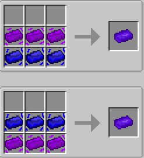
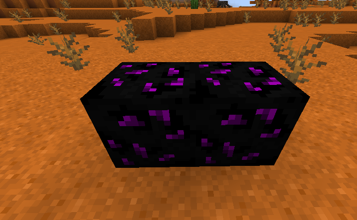
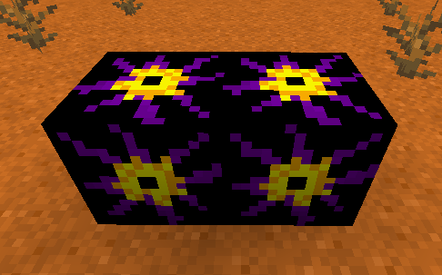

# Progression and materials

[Português](../pt/progression.md)

## The route through the mod

### Tiers

```text
Tier 0:
    → Vanilla resources, silicon components, Basic machines
Tier 1:
    → Unstable, Stable, Void, Stellar
Tier 2:
    → Duality
Tier 3:
    → Darklight
Tier 4:
    → Nova
Tier 5:
    → Zenith
Tier 6:
    → Chaos
```

## Duality



To reach the Duality tier, combine **Unstable Bar** and **Stable Bar**.

## Darklight

Once you reach Duality, craft a **Duality Pickaxe**. Find **Darklight Ore** and mine it with this pickaxe to obtain **Darklight Fragment**.



## Nova



Material requirements increase substantially at this stage. First, find an **Antimatter Block** and mine it with a **Darklight Pickaxe**. It drops **Antimatter**, which can be used to generate more **Antimatter Blocks** or as a crafting ingredient.

To reach **Nova**, craft a **Blackhole**, then drop **1 Blackhole** and **64 Darklight Bars** together to obtain **1 Nova Fragment**.

## Zenith

To reach **Zenith**, obtain **Exotic Dust** and **Zenith Shard**. Zenith Shards drop from the **Zenith Crystal Block**, which only appears in meteors. These materials let you craft **Zenith**.

## Chaos

To reach **Chaos**, you must already have a **Gateway** to access Realities. Craft empty **Reality Cores** and a **Reality Extractor**.

Enter a Reality, place the **Reality Extractor**, insert a **Reality Core** and supply energy to extract that Reality's core. Filling one **Reality Core** requires extracting from three Realities of the same type.

Then craft a **Chaotic Catalyst** and use it on a **Gateway**. The Gateway will start showing **Chaos** Realities, where you can kill **Chaos** creatures and extract **Chaos** Reality cores.

**Next:** [machines](machines.md), [Gateway](gateway.md), or [Reality Core collection](extractor.md).
