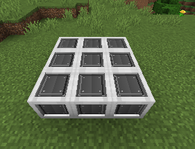
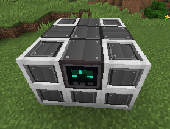
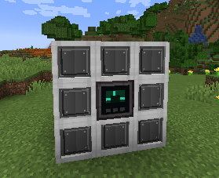

# Nova Reactor

[Português](../pt/reactor.md)

The Nova Reactor turns fuel into heat and heat into FE. Temperature, cooling and waste management are essential parts of operating it.

## Build the 3×3×3 structure

The top and bottom layers are solid 3×3 **Machine Casing**. The middle layer has a **Nova Reactor Core** in the center, a **Nova Reactor Controller** in the middle of one outer face, and casing around it. The core must be in the center.

```text
Top / bottom       Middle, example
C C C              C E C
C C C              I R I
C C C              C T C

C = Machine Casing     R = Reactor Core
T = Controller         E = Energy Port
I = Item Port

Item Ports and the Energy Port can swap positions.
```





The middle shell accepts at most **one energy port** and **two item ports**. Use the energy port for FE access, and input/output item ports for supply and waste removal. The example uses both item ports, one for each direction.

## Supply fuel and coolant

| Resource | Function | Internal value |
|---|---|---:|
| Blackhole | Fuel | 10,000 fuel units per item |
| Nova Bar | Coolant | 5,000 coolant units per item |
| Exotic Dust | Extracted waste product | Removes 5,000 waste units per item |

An input-mode item port accepts supplies; an output-mode item port exposes waste. Fuel and coolant each hold up to 1,000,000 units; waste holds 100,000. During burning, fuel consumption is 20 units/t and waste production is 10 units/t. Coolant demand increases with core heat.

## Control the temperature

Peak output is **4,000,000 FE/t**, with an ideal temperature of **25,000 K**. Output also depends on the reactor's state and calibration. Its energy buffer holds **10 billion FE**.

Use [Controller rules](controller.md) to limit Core Heat, Casing Heat and Waste, and to require sufficient Fuel and Coolant. A reasonable starting plan is to stop burning before the dangerous temperature range and allow it to resume only after cooling. Monitor both temperatures rather than treating stored FE as a safety indicator.

!!! danger "Meltdown"
    At a core temperature of **45,000 K or higher**, the reactor can enter a destructive meltdown. Do not use this threshold as your normal shutdown target. Stopping burning does not instantly remove stored heat.

Cooling and residual-heat generation continue when control pauses the reaction. Keep the energy output and waste extraction available, and verify supply before leaving the installation running.
