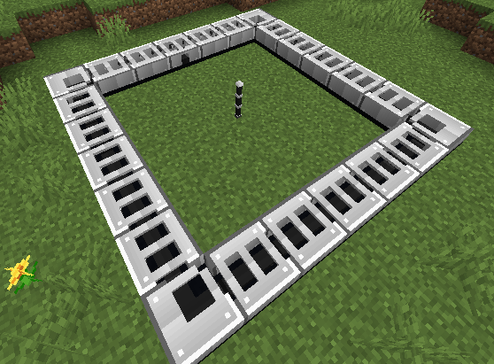

# Zenith Accelerator

[English](../en/accelerator.md)

O acelerador consome muita FE para produzir **Reality Condensate**, iniciando a progressão de núcleos dimensionais.

## Monte um anel horizontal 7×7

Use **quatro curvas**, **dezenove segmentos retos**, **um Input** no meio de um lado e **um Center Rod** no centro. Deixe o interior livre, exceto pela haste, e mantenha tudo na mesma camada horizontal.

```text
C S S S S S C
S . . . . . S
S . . . . . S
S . . R . . I
S . . . . . S
S . . . . . S
C S S S S S C
```

`C` = curva, `S` = segmento reto, `I` = Input, `R` = Center Rod, `.` = ar. Gire as peças para formar um circuito contínuo. A ramificação do Input deve apontar para a haste; ela fica três blocos na direção anti-horária em relação à orientação frontal do Input.



## Forneça energia e material

Abasteça o Input com **Zenith** ou **Zenith Bars** e reponha durante a operação. Ele armazena **512 milhões de FE** e consome **8 milhões de FE por tick de trabalho pago**. Sua interface possui uma barra de energia com os detalhes da reserva.

A carga do feixe e a FE armazenada são medidas separadas. Sem FE suficiente, o progresso e o consumo de material pausam. Sem material abaixo de 50%, a carga diminui; a partir de 50%, a carga atual pode ser usada na colisão. Chegar a 100% também prepara a colisão. O feixe termina o trajeto restante antes da injeção.

Use a regra **Release** do [Controller](controller.md) para escolher o ponto de colisão entre 50% e 100%. Reserva de energia, material de entrada e capacidade do coletor possuem regras próprias.

## Colete o resultado

### Eficiência dos materiais

Uma Zenith Bar representa **11 Zenith**. O acelerador consome barras a **1/11 da taxa de itens Zenith**, mantendo os bônus da colisão. Um ciclo completo sem interrupções consome aproximadamente **44 Zenith ou 4 Zenith Bars**: a rota de barras produz 2,5 vezes a quantidade de condensate (arredondada para baixo) e recupera 3 vezes a FE, recompensando os ingredientes adicionais usados no crafting das barras. Disponibilize pelo menos **45 Zenith ou 5 barras** para evitar liberação antecipada ao esvaziar a entrada; os itens não consumidos permanecem no Input. Cargas parciais seguem a mesma proporção de consumo.

Reality Condensate aparece **acima do Center Rod**. Automatize a coleta nesse ponto. O efeito de explosão da colisão não destrói a estrutura nem o item produzido.

| Carga da colisão | Produção com Zenith | Produção com Zenith Bar |
|---|---:|---:|
| 50% | 1 | 2 |
| 60% | 2 | 5 |
| 70% | 4 | 10 |
| 80% | 8 | 20 |
| 90% | 16 | 40 |
| 100% | 32 | 80 |

Na carga máxima, a haste recupera 250 milhões de FE com Zenith ou 750 milhões com Zenith Bars, bem menos que o gasto do ciclo. Remover ou invalidar partes da estrutura aborta o ciclo.

**Próximo passo:** fabrique recipientes Reality Core e use o [Reality Extractor](extractor.md).
